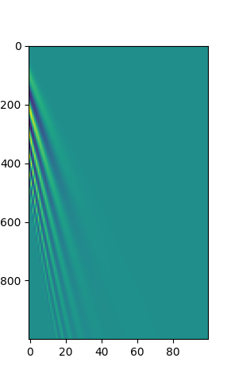

# PySeismic

python tools for seismic ground-roll (surface wave) simulation

### ground-roll simulation

```
cd ./data_synthesis
python ground_roll_syn.py 
# change the parameters inside the script to get customized result
# the synthetic result is saved as .npy format
```

sample result




ground-roll simulation parameters:

```
num_traces:     number of seismic traces (single side w.r.t source point)
num_time_samples:   number of samples in time axis
time_shift:   offset to the top
freq_low:   the lower frequency of the chirp signal to simulate dispersity
freq_high:    the higher frequency of the chirp signal to simulate dispersity
dx:   space sample interval (unit: m)
dy:   time sample interval (unit: s)
velocity:   ground-roll velocity (unit: m/s)
distance_degradation:   amplitude degradation ratio w.r.t distance
win_scale:    controls the smooth edge of window, should be larger than (or equal to) 2, the larger the shearer
duration_ratio:   controls the sampling of chirp of ground-roll in each trace
save_path:    synthetic data save path, if parent folder not exist, it will be created
```


* if this project helps you, please cite the following papers:

```latex
@article{jia2020blind,
  title={Blind separation of ground-roll using interband morphological similarity and pattern coding},
  author={Jia, Zhuang and Lu, Wenkai},
  journal={IEEE Transactions on Geoscience and Remote Sensing},
  volume={58},
  number={10},
  pages={7166--7177},
  year={2020},
  publisher={IEEE}
}
```

```latex
@inproceedings{jia2019separating,
  title={Separating ground-roll from land seismic record via convolutional neural network},
  author={Jia, Zhuang and Lu, Wenkai and Zhang, Meng and Miao, Yongkang},
  booktitle={SEG 2018 Workshop: SEG Maximizing Asset Value Through Artificial Intelligence and Machine Learning, Beijing, China, 17-19 September 2018},
  pages={60--63},
  year={2019},
  organization={Society of Exploration Geophysicists and the Chinese Geophysical Society}
}
```
